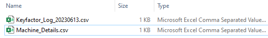

# **Document Version Control**

| **_Date_** | **_Author_** | **_Comments_** |
|--|--|--|
| 6/12/2023 | Forrest McFaddin | Initial commit of process |

# **Supported Versions**

Keyfactor Command 10.X

# **Overview**
This automation script allows Keyfactor administrators to perform mass discovery and approval of the following certificate store types:
1. Remote File - JKS (RFJKS)
2. Remote File - PEM (RFPEM)
3. Remote File - PKCS12 (RFPKCS12)

Multiple executions of this script are required to complete the discovery and approval phases of this process. After each execution, the user will add additional information to newly created files that this script creates, which will be used in the next step.

The different phases of this script are below:

1. [Script]  Create a "Machine Details" file.
2. [User]    Populate server details in the "Machine Details" file.
2. [Script]  Create Discovery jobs to discover certificate stores on machines provided in the machine details file.
3. [Script]  Export newly discovered Certificate Stores to a "Pending Cert Stores" file.
4. [User]    Populate certificate store details in the "Pending Cert Stores" file.
5. [Script]  Approve pending Certificate Stores using details in the pending cert stores file.

# **Requirements**

* At least one registered Keyfactor Universal Orchestrator

* The RFJKS,RFPEM,RFPKCS12 Certificate Store types must be created prior to running the script.

* A Keyfactor API user with appropriate access to Certificate Stores and Agents

# **Execution**

1. Copy the script to a Windows Server that is has PowerShell v5.
2. Edit the script and update the mandatory variables with your Keyfactor information.
3. Optionally, update the other variables to specify a different directory to use (default: "C:\temp").
4. Execute the script. This will create a "machine details" file at the defined location.

>You will need to enter define your Orchestrator's ID in the file. If this is unknown, enter YES at the prompt to retrieve your Orchestrator(s) ID.  <IMAGE>
6. Upon continuing, the script will finish since expected files and/or pending Certificate Stores will be found in Keyfactor.
7. Locate the new "machine details" file. Optionally, and for ease of editing, use Microsoft Excel to open and edit this file.  <IMAGE>
8. Add servers that you wish to scan for Certificate Stores, taking care that the file header row is not modified.
  
<details><summary>Machine Details File - Value definitions</summary>
  
  
  ### Machine Details File - Details
  The acceptable values are:
  * StoreType(RFJKS/RFPEM/RFPKCS12)
     * (String) The type of Certificate Store to scan for: RFJKS, RFPEM, or RFPKCS12.
  * OrchestratorID
     * (GUID) The ID of the Keyfactor Orchestrator to perform discovery
  * MachineName
     * (String) The FQDN of the server to be scanned
  * ServerUsername
     * (String) The username of the account used for authenticating to the server, which has appropriate access.
  * ServerPassword
     * (String) The password of the account (above).
  * UseSSL
     * (Boolean) Whether SSL (WinRM HTTPS) will be used when connecting to the target sserver.
  * DirectoriesToSearch
     * (String) The filepath to start recursive scanning.
  * DirectoriesToIgnore
     * (String) Directory
  
  Additional information about Certificate Store Discovery can be found in the official Keyfactor Documentation here: [Keyfactor Certificate Store Discovery](https://software.keyfactor.com/Content/ReferenceGuide/Certificate%20Store%20Discovery.htm?Highlight=certificate%20store%20discovery "Keyfactor Certificate Store Discovery")
    
  </p>
  </details>
  
  8. Once the machine details file is save, ensure the updated copy is in the originally created location and execute the script again.
  9. Enter "yes" when asked to create new discovery jobs.
  
  
  
  
  
  
  
  
  
  
  #  Appendix
  


```
