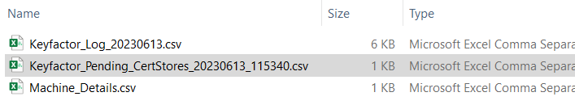

# **Document Version Control**

| **_Date_** | **_Author_** | **_Comments_** |
|--|--|--|
| 6/12/2023 | Forrest McFaddin | Initial commit of process |
| 6/14/2023 | Forrest McFaddin | Readme and documentation updates |

# **Supported Versions**

Keyfactor Command 10.X

# **Overview**
This automation script allows Keyfactor administrators to perform mass discovery and approval of the following certificate store types:
1. Remote File - JKS (RFJKS)
2. Remote File - PEM (RFPEM)
3. Remote File - PKCS12 (RFPKCS12)

Multiple executions of this script are required to complete the discovery and approval phases of this process. After each execution, the user will add additional information to newly created files that this script creates, which will be used in the next step.

The different phases of this script are:

1. [Script]  Create a "Machine Details" file. [[Goto]](#create--prepare-the-machine-details-file)
2. [User]    Populate the file with server details.
2. [Script]  Schedule Certificate Store Discovery jobs for machines provided. [[Goto]](#schedule-certificate-store-discovery-jobs)
3. [Script]  Export newly discovered Certificate Stores to a "Pending Cert Stores" file. [[Goto]](#export-newly-discovered-certificate-stores)
4. [User]    Populate certificate store details in the "Pending Cert Stores" file. [[Goto]](#prepare-the-pending-certificate-stores-file)
5. [Script]  Approve pending Certificate Stores. [[Goto]](#approve-pending-certificate-stores)

A workflow diagram of this process can be found [here.](KF-Approve-CertStores-Process.pdf)
# **Requirements**

* At least one registered Keyfactor Universal Orchestrator.
* The RFJKS, RFPEM, and RFPKCS12 Certificate Store types must exist in Keyfactor Command prior to running the script.
* A Keyfactor API user with appropriate access to Certificate Stores and Agents.
* Credentials to servers that the Keyfactor Orchestrator will perform discovery on.

# **Execution**

### Create & Prepare the Machine Details File
1. Copy the script to a Windows Server that has PowerShell v5.
2. Edit the script and update the mandatory variables with your Keyfactor Command information.
3. Optionally, update the other variables to specify a different directory to use (default: "C:\temp").
4. Execute the script. This will create a "machine details" file at the defined location.

>You will need to enter define your Orchestrator's ID in the file. If this is unknown, enter "**Yes**" when prompted to retrieve your Orchestrator(s) ID.<br><br>
>
6. Upon continuing, the script will finish since expected files are missing and/or pending Certificate Stores will not be found in Keyfactor.
7. Locate the new "machine details" file. Optionally, for ease of editing, use Microsoft Excel to open and edit this file.  <IMAGE>
8. Add servers that you wish to scan for Certificate Stores, taking care that the file header row is not modified.<br><br>
  
<br>
  Additional information for this file and its columns requirements can be found below:
  <details><summary><h4>SEE: Machine Details File - Value definitions</h4></summary>
  
  
  ### Machine Details File - Details
  The acceptable values are:
  * **StoreType(RFJKS/RFPEM/RFPKCS12)**
     * (string) The type of Certificate Store to scan for: RFJKS, RFPEM, or RFPKCS12.
  * **OrchestratorID**
     * (guid) The ID of the Keyfactor Orchestrator to perform discovery
  * **MachineName**
     * (string) The FQDN of the server to be scanned
  * **ServerUsername**
     * (string) The username of the account used for authenticating to the server, which has appropriate access.
  * **ServerPassword**
     * (string) The password of the account (above).
  * **UseSSL**
     * (bool) Whether SSL (WinRM HTTPS) will be used when connecting to the target sserver.
  * **DirectoriesToSearch**
     * (string) The filepath to start recursive scanning.
  * **DirectoriesToIgnore**
     * (string) Directories to ignore (comma delimited)
  
  Additional information about Certificate Store Discovery can be found in the official Keyfactor Documentation here: [Keyfactor Certificate Store Discovery](https://software.keyfactor.com/Content/ReferenceGuide/Certificate%20Store%20Discovery.htm?Highlight=certificate%20store%20discovery "Keyfactor Certificate Store Discovery")
    
  </p>
  </details>
  
### Schedule Certificate Store Discovery Jobs
  9. Once the machine details file is saved, ensure the updated copy is located in its original location.
  10. Execute the script again, and enter "**Yes**" when prompted to create new discovery jobs. <br><br> 
  11. Once completed, the Keyfactor Orchestrator that you defined will perform Discovery scanning on the provided servers.
  
### Export Newly Discovered Certificate Stores
  12. Wait until "Discovered" Certificate Stores are seen within Keyfactor Command.<br><br>
  
  13. Execute the script again. Enter "**No**" when prompted to create discovery jobs.
  14. Enter "**Yes**" when prompted to export Pending Certificate Stores.<br><br>
  
  15. Locate the new "Pending Certificate Stores" file. Optionally, for ease of editing, use Microsoft Excel to open and edit this file.<br><br>
  

### Prepare the Pending Certificate Stores file
  16. Edit the file to provide additional information to approve the Certificate Stores.<br><br>
  <br>
  > Note: Supplying server credentials in this file is optional if a completed Machine Details file is still available for this script to use. When the process attempts to approve Certificate Stores, it first attempts to use credentials in the Pending Certificate Stores file. If a credential is not found, the Machine Details file will then be checked.<br>
  17. When adding Certificate Store details, not all fields are required and will depend on the certificate store file. For example, is a PEM file encrypted or not? Does it include a private Key?
  > Note: For boolean values, leaving values null will default it to FALSE.
<br>
Additional information for this file and its columns requirements can be found below:
<details><summary><h4>SEE: Pending Certificate Stores File - Value Definitions</h4></summary>
  
  ### Pending Certificate Stores File - Details
  Details regarding the values within the Pending Certificate Stores file can be found below:
  * **CertStoreTypeID**
     * (int) Keyfactor ID of the certificate store type. This is automatically included in the file.
  * **ContainerID**
     * (int) Optional Keyfactor Container ID to assign the certificate store to.
  * **MachineName**
     * (string) The FQDN of the server for the certificate store. This is automatically included in the file.
  * **UseSSL**
     * (bool) Whether to use SSL for connections. For Windows Servers, UseSSL enables WinRM (HTTPS)
  * **ServerUsername**
     * (string)(optional) The username of the account to use for authentication. If provided, this value takes priority over credentials supplied in the "machine details" file.
  * **ServerPassword**
     * (string) Optional: The password of the account above. Must be supplied if ServerUsername includes a value. 
  * **StorePath**
     * (string) The filepath of the discovered certificate store. This is automatically included in the file.
  * **CertStorePassword**
     * (string) The password for the certificate store file. If the certificate store does not include a password, this value can remain null, however, a warning will be displayed when approving certificate stores.
  * **IncludesChain**
     * (bool)(optional) Whether the file includes a full certificate chain.
  * **IsRSAPrivateKey**
     * (bool)(optional) Whether the file includes a private key. <br><br>
        > Only relevant for .PEM certificate stores.
  * **IsTrustStore**
     * (bool)(optional) Whether the certificate file is a Trust Store. <br><br>
       > Only relevant for .PEM certificate stores. <br>
       >
       > If 'true', this store will be identified as a trust store. Any certificates attempting to be added via a Management-Add job that contains a private key will raise an error with an accompanying message.
  * **SeparatePrivateKeyFile**
     * (string)(optional) Filepath for the private key of the certificate store. <br><br>
        > Only relevant for .PEM certificate stores.
  * **LinxFilePermissionOnCreate**
     * (int)(optional) Linux File Permissions to set, if Keyfactor is creating the file. (e.g '600')
  * **LinuxFileOwnerOnCreate**
     * (string)(optional) The owner to set, if Keyfactor is creating the file. (e.g "myuser")
  * **InventorySchedule(Minutes)**
     * (int)(optional) The interval in minutes for Keyfactor to inventory the certificate store.
  * **InventorySchedule(Daily)(Time)**
     * (time)(optional) The time of day for Keyfactor to inventory the certificate store (e.g "12:00")
  * **InventorySchedule(Once(DateTime))**
     * (string)(optional) The datetime for Keyfactor to perform a SINGLE inventory job of the certifcate store (e.g "6/14/2023 13:00")<br><br>
        > Note about schedules: Only 1 schedule can be defined for a certificate store (either interval minutes, daily, or once). Leaving all values blank is permissable, but will cause Keyfactor to not inventory the certificate store until a schedule has been added.
  
</details>


### Approve Pending Certificate Stores
18. Once you have finished preparing the Pending Certificate Stores file, execute the script again.
19. Enter "**No**" when asked to schedule discovery jobs.
20. When prompted to continue with Certificate Store approval, enter "**Yes**"
21. When prompted if the correct file has been identified, enter "**Yes**"
    > If multiple "Pending Certificate Stores" files exist, enter "No" until you are prompted for the correct file.
22. The process will approve all certificate stores:<br><br>

  
  
### Logging
This process logs all events to the defined file. <br><br>

  
 
```
