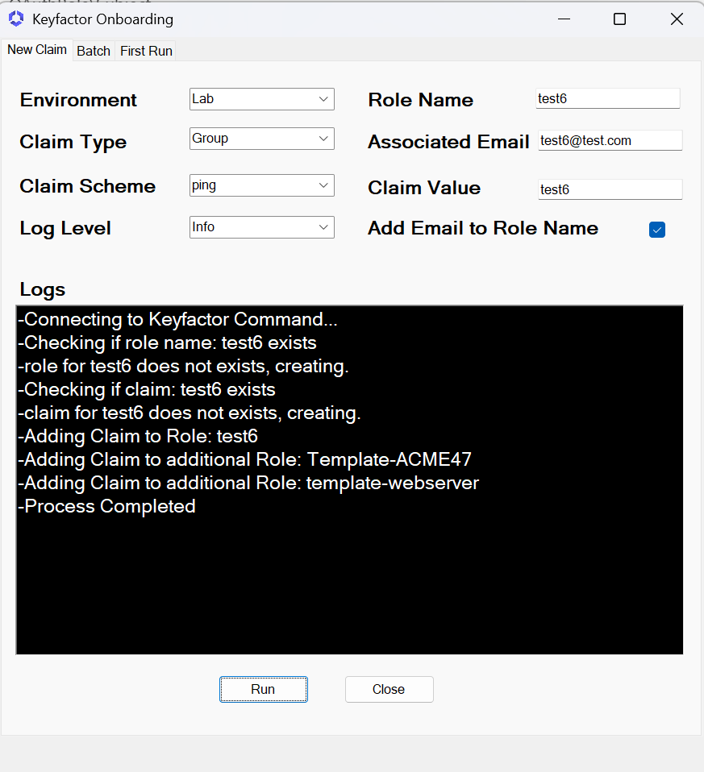

# Keyfactor Onboarding Application

The provided PowerShell Application is designed for onboarding and managing **Keyfactor roles, collections, and claims** in a Keyfactor environment. Below is a breakdown of the application's purpose, its key features, and examples of how it functions.

---
## **Table of Contents**
- [Purpose](#purpose)
- [Key Features](#key-features)
- [Minimum Requirements](#minimum-requirements)
- [Setup](#setup)
- [Support](#support)
- [Logging](#logging)
- [Using the Application](#using-the-application)
- [Notes](#notes)
- [Error Handling](#error-handling)
- [Conclusion](#conclusion)
- [Links](#links)
---
## **Purpose**

The script automates several Keyfactor management tasks, and creates a standard around onboarding user or groups of users. The script gives the ability to automate and create standard roles and permissions for all new users of command.

---

## **Key Features**
### **1. Multi-Environment Support**
The Application allows onboarding in different environments:
- **Production**: Production-ready configurations.
- **NonProduction**: For testing/staging environments.
- **Lab**: Testing setups.

### **2. Flexible Validation**
- Logging can be customized using one of three levels: `Info`, `Debug`, or `Verbose`.

### **3. Single or Multiple onboarding options**
- Can onboard a single team or a batch of teams using a CSV.

---

## **Minimum Requirements**
### **Application Requirements**
- PowerShell V5
- Configured ApplicationSettings.ini file

### **Keyfactor Requirements**
- A Client Credential Claim added to Keyfactor Command
- A role with the Client Credential claim and the following permissions
    - /security/read/
    - /security/modify/
    - /certificates/collections/read/

## **Setup**
### **Description**
The Application uses an INI file called ApplicationSettings.ini.  The file format follows the standard ini format of section.subsection.  this file is required to run the application.  in the file the defaults will be listed as well as the authentication information.
### **First Run**
The first time you run the application you c=need to select the **First Run** tab and select the **Create INI** button.  this will place an example INI file with the proper name in the directory the application is ran from.
Once the file is created, open the file in any text editor and fill in the INI File sections and subsections.
**WARNING**
Thenames in the INI file must remain the same for application to function
### **ApplicationSettings.INI File Setup**
- **Sections**
    - [Environment:Lab]
    - [Environment:NonProduction]
    - [Environment:Production]
- **Sub Sections**
    - [Environment:Lab.OAuth]
    - [Environment:Lab.Permissons]
    - [Environment:Lab.Collections]
    - [Environment:Lab.roles]
#### **Understanding Permission\Collections\Roles**
- **Permissions**
    - permissions are based on a name=value format
    - the name is used to give you an meaningful name to referance but is not used by the application.
    - the value is based on the permission structure and format that Keyfactor Command uses. (ex: /portal/read/ gives that claim the permission to login to the portal).
    - to set collection permissions, list the permission without the id at the end. (ex: /certificates/collections/read/1 needs to be just /certificates/collections/read/).
- **Collections\Roles**
    - These sections will add your claim to each role listed as well as the role the application creates.  It will slo set the permissions to each collection listed based on the permissions subsection.
    - The roles and collections is formated in a Interger=value format
    - The intiger is just a euiqe number, the value is the name of the collection and or role.

| **Parameter**          | **Section** | **Description** |
|------------------------|-------------|-----------------------------------------------------------------------------------------------------------------------------------------------------------------------------------------------------------------|
| `Schemes`    | Environment Section | **(Required)** The name of the Identity Provider AuthenticationScheme list in Keyfactor Command. If there are multiple, you can list these in a comma-delimited list wrapped with single quotes (ex: 'azure,ping'). |
| `ClaimDesc`  | Environment Section | **(Required)** The string that will be the description listed in the claim. |
| `RoleDesc`   | Environment Section | **(Required)** The string that will be the description listed in the role. |
| `KFAPIURL`   | Environment Section | **(Required)** The URL of the Keyfactor Command API (ex: https://customer.keyfactorpki.com/keyfactorapi). |
| `ClientId`   | Oauth Sub-Section   | **(Required)** Type of Client Id of the Client Credential Application that will have the required permissions in Keyfactor Command. |
| `TokenURL`   | Oauth Sub-Section   | **(Required)** The Token URL for your Identity provider to get a bearer token. |
| `Scope`      | Oauth Sub-Section   | **(Optional unless required by IDP)** The scope for Client Credential Application. |
| `Audience`   | Oauth Sub-Section   | **(Optional unless required by IDP)** The Audience for Client Credential Application. |

---
## **Support**
This application and code serves as a working example is is not supported by Keyfactor Support.  Customers are encurraged to use, test, or change the application to fit thier usecases.

---

## **Logging**
- Verbose logging for **debugging** uses the `-loglevel` parameter:
  - **Info**: Standard operational logs.
  - **Debug**: Detailed logs for troubleshooting.
  - **Verbose**: Step-by-step execution tracking.

---

## **Using the Application**
### **New Claim Tab Parts**
- **Environment (Required)**
    - Dropdown of the Enviroemnt Section of the INI file
    - Load the variables from the environment section you choose.
- **Claim Type (Required)**
    - Dropdown of the type of claim you want to load (User\Group) translates to Keyfactor as OAuthRole\Subject.
- **Claim Scheme (Required)**
    - Dropdown that is dynically loaded based on what is in the "Scheme" value of the INI file
    - this is used to define the claims scheme as it is loaded
- **Log Level (Required)**
    - Dropdown of standard application loging levels
    - No secure information is presented in the Logs
- **Role Name  (Required)**
    - TextBox where you will list the name of the role you which to create
- **Associated Email (Optional\Required)**
    - TextBox where an email is name@name.name format is expected.
    - This will fill in the role email in the role that is created.
    - Optional unless the "Add Email to Role Name" is selcted.
- **Claim Value (Required)**
    - TextBox of the value that Keyfactor Command can expect in the OAuthRole or Subject
- **Add Email to Role Name (Optional)**
    - CheckBox for true or false
    - if selected the "Associated email becomes required.
    - This option will add the associated email to the role name (ex: "team (name@name.com)")
### **Running the Application for New Claim**
1. fill out all required fields and select all required dropdowns
2. Select Run Button
3. Review the Logs in the Output box for Success

### **Batch Tab Parts**
- Create CSV
    - Selecting the Bowse Button will allow you to chose a location to export a claims.csv file that has all the appropreate headers in place.
    - **DO NOT CHANGE THE HEADERS**
- Load CSV
    - Selecting the browse button will allow you to select the claims.csv to load after it has been filled out.
- Environment
    - Dropdown allows you to chose the enviroment to run the CSV against based on the INI file
### **Running the Application for Batch Jobs**
1. Create the CSV
2. Fill out all required calls based on the CSV Headers
3. Load the CSV
4. Choose a Environment
5. Slect the Run Batch Button
## **Notes**
- once you select the Run Batch Button it will direct you to the New Claim tab to see the output of the process
- you can alway see the path of the INI file the aplication is used in the First Run tab under the Application Settings Path
- Secrets are never stored and will be required on each run.
---

## **Error Handling**
- Errors are logged.
- Validation is in place to validate all entries to include the CSV File

---

## **Conclusion**

This script is a powerful and flexible tool for automating Keyfactor onboarding processes, including creating roles, collections, and managing claims for OAuth-based integrations. It supports diverse environments, dynamic configurations, and modularity to simplify large-scale deployments.

## Links
- [Explination of Batch Code](https://github.com/Keyfactor/adoption-and-enablement-examples/blob/Team-Onboarding/OnBoarding/BatchCode.md)
- [Explination of Onboarding Code](https://github.com/Keyfactor/adoption-and-enablement-examples/blob/Team-Onboarding/OnBoarding/Code.md)
- [Batching Script](https://github.com/Keyfactor/adoption-and-enablement-examples/blob/Team-Onboarding/OnBoarding/Batching.ps1)
- [OnBoarding Script](https://github.com/Keyfactor/adoption-and-enablement-examples/blob/Team-Onboarding/OnBoarding/keyfactor_onboarding.ps1)
- [Variable File](https://github.com/Keyfactor/adoption-and-enablement-examples/blob/Team-Onboarding/OnBoarding/Variables.ps1)
- [Keyfactor Command Documentation](https://software.keyfactor.com)